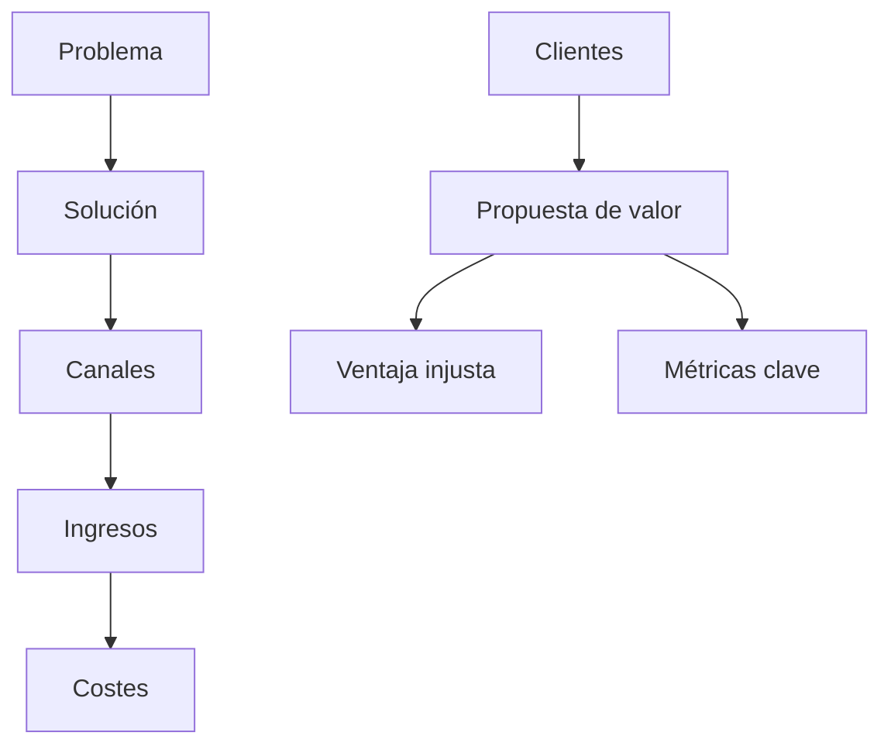
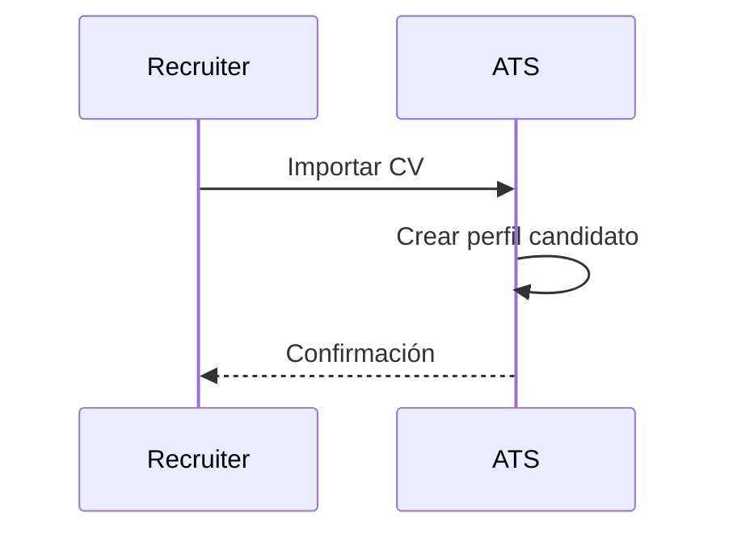
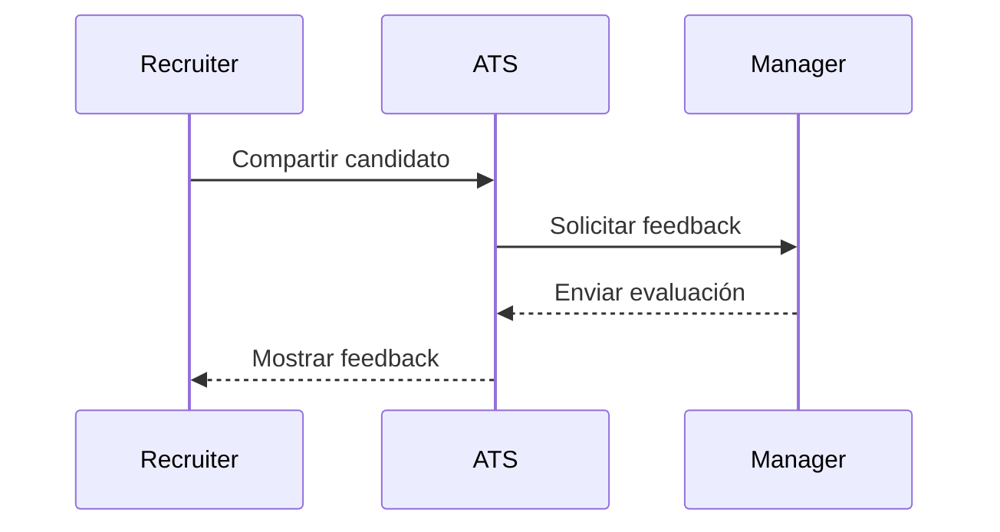
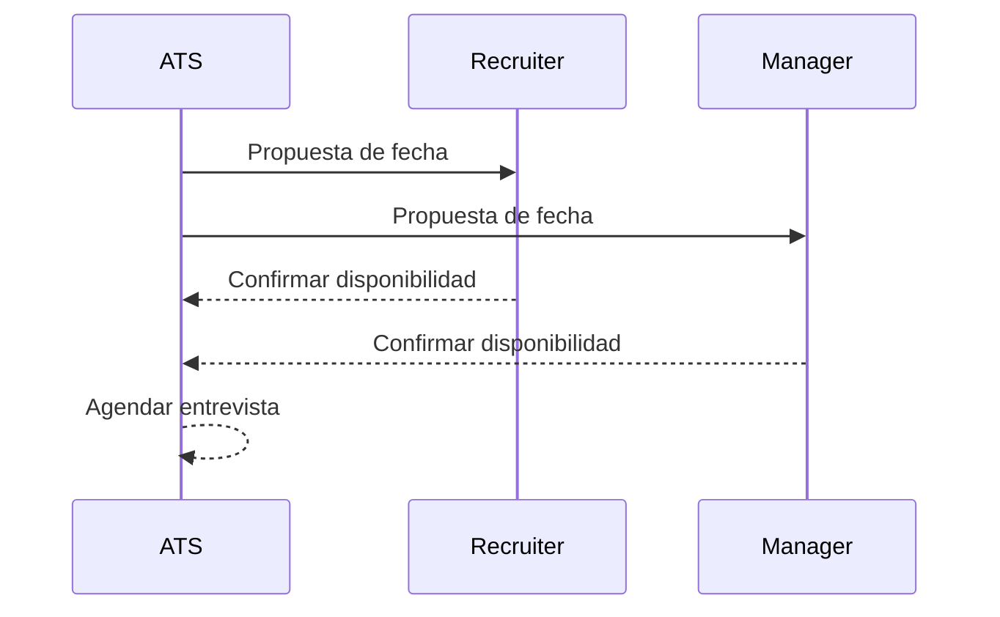
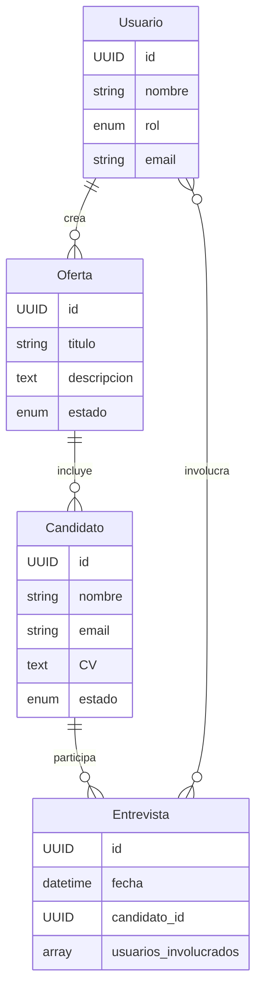
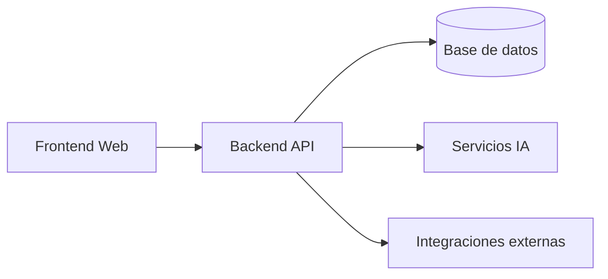
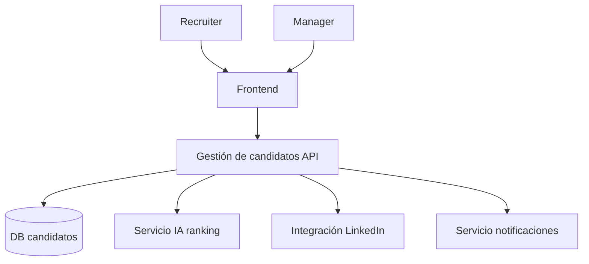

# `LTI-JDLM`

## 📌 Descripción breve del software LTI
**LTI ATS** es un sistema de gestión de candidatos diseñado para revolucionar el proceso de reclutamiento. Su valor diferencial radica en:
- 🚀 **Automatización inteligente** de tareas repetitivas (screening, notificaciones, entrevistas).  
- 🤝 **Colaboración en tiempo real** entre reclutadores y managers.  
- 🧠 **Asistencia de IA** para mejorar la toma de decisiones (ranking de candidatos, redacción de ofertas, análisis de CV).  
- 📊 **Analítica avanzada** para optimizar procesos de contratación.  

**Ventajas competitivas:**  
- Reducción de tiempos de contratación.  
- Experiencia colaborativa fluida.  
- Integración con herramientas externas (LinkedIn, correo, calendarios).  
- Escalabilidad y modularidad para startups y grandes corporaciones.  

---

## ⚙️ Funciones principales
- **Gestión de candidatos:** Registro, seguimiento, evaluación y comunicación.  
- **Automatización:** Envío de correos, recordatorios de entrevistas, generación de informes.  
- **Colaboración:** Espacios compartidos para feedback en tiempo real.  
- **IA aplicada:**  
  - Ranking de candidatos según perfil.  
  - Generación automática de descripciones de puestos.  
  - Chatbot para responder dudas de candidatos.  
- **Analítica:** Métricas de tiempo de contratación, fuentes de candidatos más efectivas, tasa de éxito.  

---

## 📊 Lean Canvas

| Sección | Contenido |
|---------|-----------|
| **Problema** | Procesos de contratación lentos, falta de colaboración, exceso de tareas manuales. |
| **Clientes** | Departamentos de HR, managers, startups en crecimiento, grandes corporaciones. |
| **Propuesta de valor** | ATS con IA, colaboración en tiempo real y automatización avanzada. |
| **Solución** | Plataforma modular con IA integrada, dashboards y workflows automáticos. |
| **Canales** | SaaS en la nube, integraciones con LinkedIn, correo y calendarios. |
| **Ingresos** | Suscripción mensual/por usuario, planes premium con analítica avanzada. |
| **Costes** | Infraestructura cloud, desarrollo, soporte, marketing. |
| **Métricas clave** | Tiempo medio de contratación, satisfacción de HR, tasa de adopción. |
| **Ventaja injusta** | IA propietaria para ranking de candidatos y generación de contenido. |

---

## 🎯 Casos de uso principales

### Caso de uso 1: **Registrar candidato automáticamente**
**Descripción:** El sistema importa CV desde LinkedIn o correo y crea un perfil.  
**Diagrama:**
```
[Recruiter] --> (Importar CV) --> [Sistema ATS] --> (Crear perfil candidato)
```

### Caso de uso 2: **Colaboración en feedback**
**Descripción:** Manager y recruiter evalúan candidatos en tiempo real.  
**Diagrama:**
```
[Recruiter] --> (Compartir candidato) --> [Sistema ATS] --> (Feedback manager)
```

### Caso de uso 3: **Automatización de entrevistas**
**Descripción:** El sistema agenda entrevistas automáticamente según disponibilidad.  
**Diagrama:**
```
[ATS] --> (Consultar calendario) --> [Recruiter] & [Manager] --> (Confirmar entrevista)
```

---

## 🗂️ Modelo de datos

**Entidades principales:**

- **Usuario**  
  - id (UUID)  
  - nombre (string)  
  - rol (enum: recruiter, manager, admin)  
  - email (string)  

- **Candidato**  
  - id (UUID)  
  - nombre (string)  
  - email (string)  
  - CV (text/blob)  
  - estado (enum: aplicado, entrevista, oferta, rechazado)  

- **Oferta**  
  - id (UUID)  
  - título (string)  
  - descripción (text)  
  - estado (enum: abierta, cerrada)  

- **Entrevista**  
  - id (UUID)  
  - fecha (datetime)  
  - candidato_id (FK)  
  - usuarios_involucrados (array UUID)  

**Relaciones:**  
- Usuario ↔ Oferta (1:N)  
- Oferta ↔ Candidato (1:N)  
- Candidato ↔ Entrevista (1:N)  
- Usuario ↔ Entrevista (N:M)  

---

## 🏗️ Diseño de alto nivel

**Explicación:**  
El sistema se organiza en módulos:  
- **Frontend web** (React/Angular).  
- **Backend API** (Node.js + Express, documentado con OpenAPI).  
- **Base de datos** (PostgreSQL/MongoDB).  
- **Servicios de IA** (ranking, generación de descripciones).  
- **Integraciones externas** (LinkedIn, correo, calendarios).  

**Diagrama:**
```
[Frontend] --> [Backend API] --> [DB]
                     |
                     --> [Servicios IA]
                     --> [Integraciones externas]
```

---

## 🔎 Diagrama C4 (nivel de componente)

**Componente elegido:** **Módulo de Gestión de Candidatos**

- **Contexto:** Reclutadores y managers interactúan con candidatos.  
- **Contenedor:** Backend API.  
- **Componentes:**  
  - **Gestión de perfiles** (CRUD candidatos).  
  - **Ranking IA** (evaluación automática).  
  - **Integración LinkedIn** (importación de CV).  
  - **Notificaciones** (correo, alertas).  

**Diagrama (simplificado):**
```
[Recruiter] --> [Frontend] --> [Gestión de candidatos API]
                                     |--> [DB candidatos]
                                     |--> [Servicio IA ranking]
                                     |--> [Integración LinkedIn]
                                     |--> [Servicio notificaciones]
```

## Diagramas en Mermaid

Perfecto, liparis. Vamos a mejorar tu entrega usando **Diagrams as Code (DaC)** con **Mermaid** para que los diagramas estén directamente integrados en el documento Markdown. Así tu `LTI-LIP.md` quedará más profesional y reproducible.

---

## 📊 Lean Canvas


---

## 🎯 Caso de uso 1: Registrar candidato automáticamente


---

## 🎯 Caso de uso 2: Colaboración en feedback


---

## 🎯 Caso de uso 3: Automatización de entrevistas


---

## 🗂️ Modelo de datos


---

## 🏗️ Diseño de alto nivel


---

## 🔎 Diagrama C4 (Gestión de candidatos)
