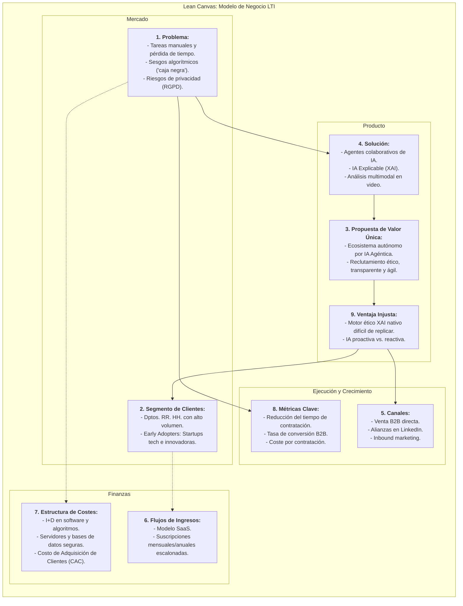
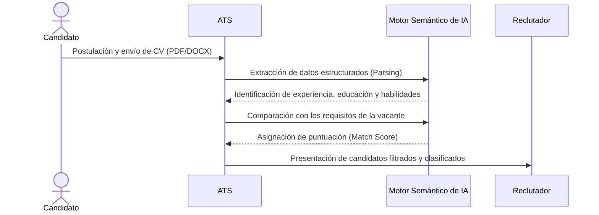
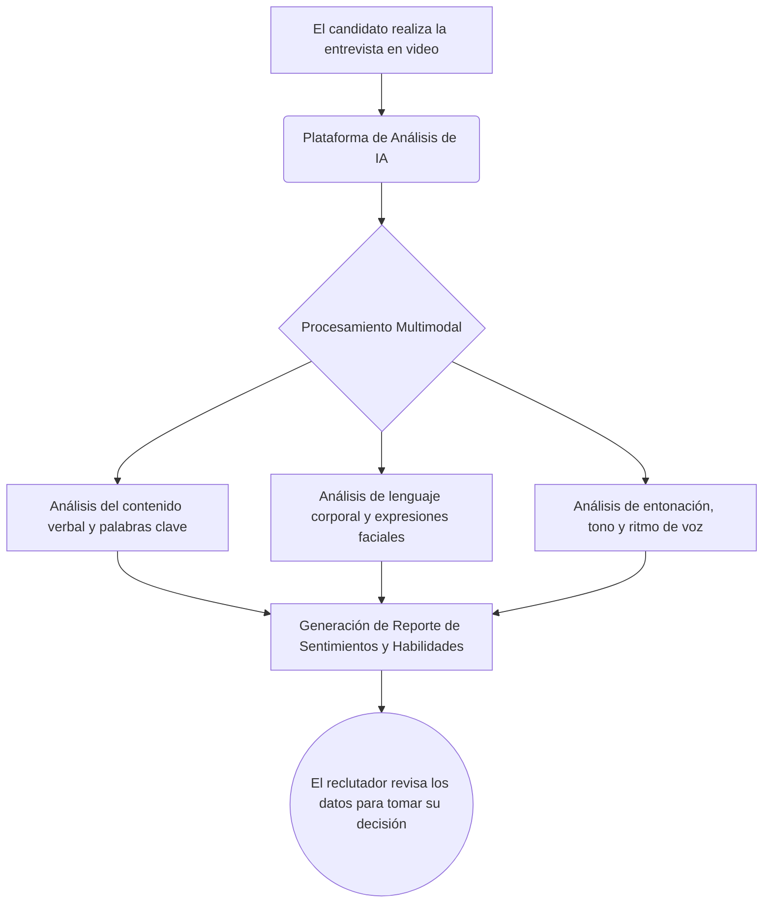
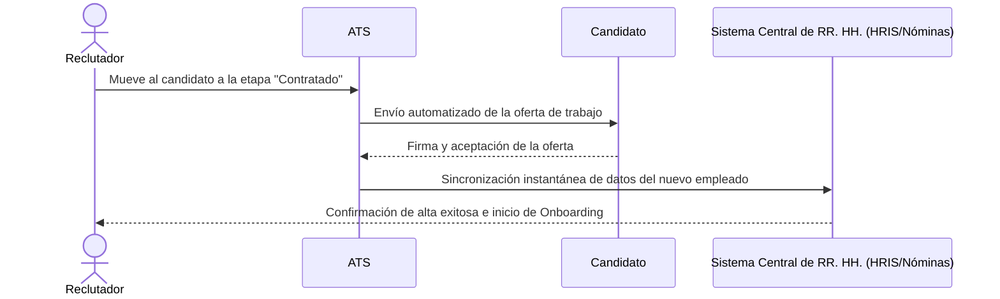
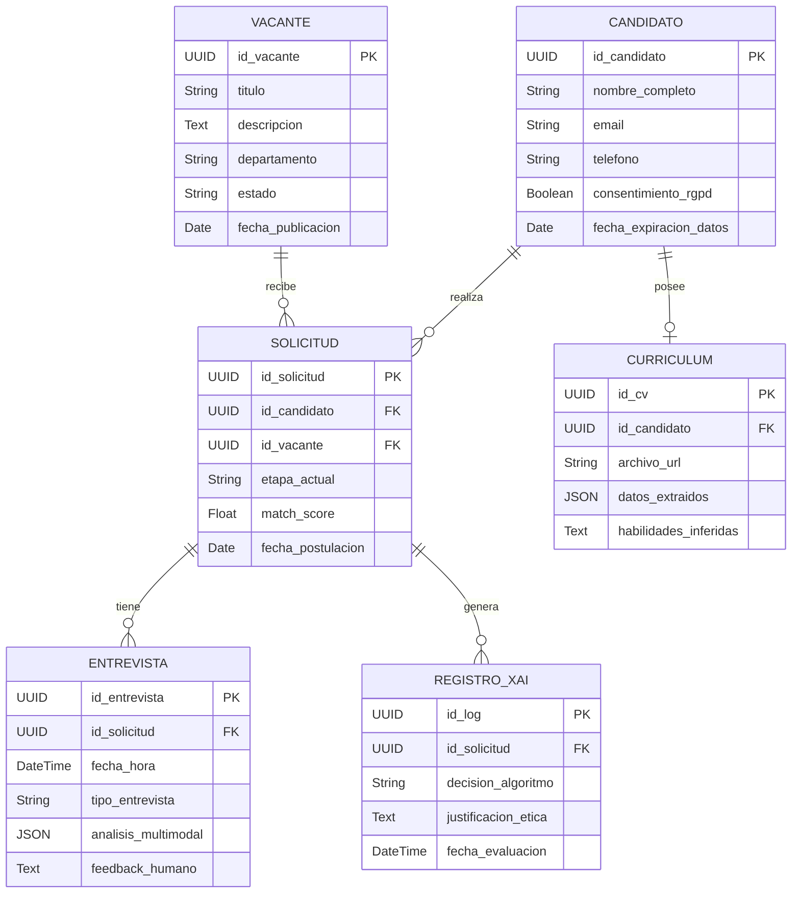
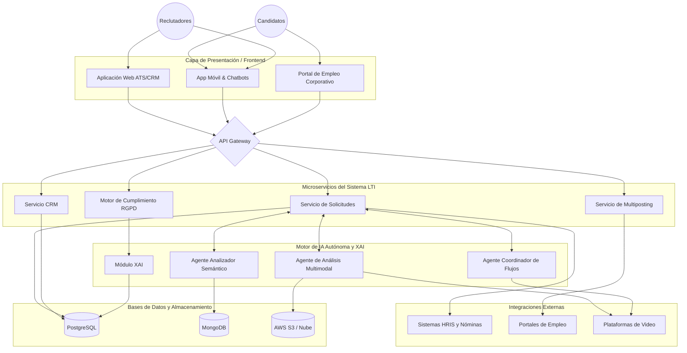
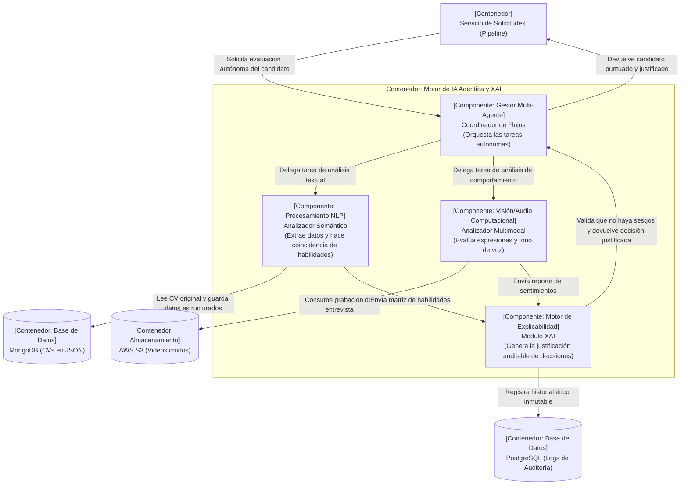

# Sistema LTI (Descripción del software)

## Descripción del software

**LTI** es un Sistema de Seguimiento de Candidatos (ATS) de nueva generación impulsado por Inteligencia Artificial Agéntica y diseñado para centralizar, automatizar y transformar estratégicamente el proceso de reclutamiento de principio a fin. En lugar de ser un simple repositorio de currículums, LTI actúa como un ecosistema colaborativo que conecta a las empresas con el mejor talento a través de flujos de trabajo autónomos, garantizando un proceso eficiente, ético y centrado en mejorar radicalmente la experiencia tanto del candidato como del reclutador.

## Valor Añadido

*   **Inteligencia Artificial Explicable (XAI) y Reclutamiento Ético:** A diferencia de los sistemas tradicionales que operan como una "caja negra", LTI integra XAI para proporcionar total transparencia sobre por qué un algoritmo toma una decisión o recomienda un perfil. Esto permite auditar los procesos, mitigar sesgos algorítmicos discriminatorios y fomentar una contratación verdaderamente inclusiva, incluso para personas con discapacidad.
*   **Análisis Multimodal de Sentimientos en Video:** LTI va más allá del análisis de texto. Incorpora tecnología capaz de procesar señales faciales, microexpresiones, tono de voz y respuestas emocionales en las entrevistas por video, evaluando las habilidades blandas y la compatibilidad cultural con un 92% de precisión.
*   **Gobernanza y Privacidad desde el Diseño (Cumplimiento RGPD/DPDP):** Resuelve de raíz uno de los mayores dolores de cabeza de los equipos legales y de RR. HH. LTI automatiza el ciclo de vida del consentimiento del candidato, genera alertas en tiempo real sobre la caducidad de los datos, gestiona el borrado automático de perfiles inactivos y ofrece portales para que los candidatos ejerzan sus derechos de privacidad fácilmente.

## Ventajas Competitivas

*   **Automatización Avanzada mediante Equipos de Agentes IA:** LTI no espera instrucciones paso a paso. Utiliza un sistema multiagente donde diferentes IAs especializadas colaboran entre sí de forma autónoma. Un agente analiza el currículum, otro evalúa habilidades técnicas, otro redacta comunicaciones personalizadas y otro programa la entrevista en el calendario, ejecutando flujos de trabajo enteros en minutos.
*   **Enfoque "Mobile-First" y Atracción Omnicanal:** LTI permite a los equipos de selección gestionar todo el proceso, evaluar y comunicarse desde cualquier lugar mediante una aplicación móvil robusta. Para el candidato, ofrece interacción moderna con opciones como el *text-to-apply* (postulación por SMS o WhatsApp) y chatbots inteligentes. Además, su herramienta de **multiposting** garantiza la publicación automática de vacantes en decenas de portales y redes sociales con un solo clic.
*   **Fusión de ATS con CRM de Reclutamiento:** LTI no se limita a gestionar a los postulantes que buscan empleo activamente. Integra funciones de Gestión de Relaciones con Candidatos (CRM) para construir, segmentar y nutrir *reservas de talento (talent pools)*, interactuando de forma proactiva con perfiles valiosos para futuras necesidades de la empresa.
*   **Analítica Predictiva y Retorno de Inversión (ROI):** LTI cruza el historial de los candidatos y métricas de desempeño para aplicar modelos predictivos que pronostican el éxito y la retención del talento a largo plazo. Ofrece cuadros de mando avanzados que permiten a los reclutadores medir con precisión el coste por contratación, el tiempo de cobertura y la satisfacción del gerente de contratación, áreas donde las plataformas convencionales suelen fallar.

## diagrama Lean Canvas del modelo de negocio de LTI

## Tres casos de uso del sistema LTI

**Caso de Uso 1: Recepción y Criba Semántica de Currículums (Parsing y Matching)**

Los sistemas ATS modernos extraen los datos estructurados del currículum (como información de contacto, habilidades y experiencia) a través de un proceso llamado *parsing*. Posteriormente, mediante el uso de modelos de procesamiento de lenguaje natural (NLP), el sistema no solo cuenta palabras clave exactas, sino que realiza una coincidencia semántica para comprender sinónimos y contextos. Esto permite clasificar y asignar una puntuación (*score*) a los candidatos según su grado de compatibilidad con la descripción del puesto, mostrando a los reclutadores un ranking ordenado.

**Caso de Uso 2: Evaluación Automatizada de Entrevistas en Video (Análisis Multimodal)**

Este caso de uso integra inteligencia artificial para analizar a los candidatos durante entrevistas por video, ya sean grabadas o en vivo. El sistema procesa de forma avanzada las señales faciales, el lenguaje corporal, la entonación y el ritmo de voz del candidato. Al evaluar estas características, la IA puede detectar el nivel de confianza, claridad y respuestas emocionales, generando informes de sentimientos detallados y objetivos sobre las habilidades blandas del postulante.

**Caso de Uso 3: Integración de Datos de RR. HH. y Automatización del Flujo de Trabajo (Onboarding)**

Un aspecto vital del ATS es su capacidad para conectarse fluidamente con otras herramientas de Recursos Humanos, nóminas y evaluación, de modo que los datos de los nuevos empleados fluyan automáticamente y sin la necesidad de intervención manual. Cuando un candidato es seleccionado, el ATS automatiza el envío de ofertas, sincroniza los perfiles hacia los sistemas base de la empresa y comienza el proceso de incorporación (*onboarding*), lo cual ahorra tiempo, reduce errores administrativos y protege los datos confidenciales de los candidatos.

## **Modelo de Entidad-Relación (ER)**. 

### 1. Entidades y Atributos

**CANDIDATO (Datos personales y cumplimiento legal)**
Esta entidad almacena la información personal del postulante y los controles de privacidad, asegurando que el sistema automatice el ciclo de vida del consentimiento y el borrado automático de registros inactivos.
*   `id_candidato` (UUID): Identificador único del candidato.
*   `nombre_completo` (String): Nombre del usuario.
*   `email` (String): Correo electrónico de contacto.
*   `telefono` (String): Número de teléfono (útil para postulaciones vía SMS/WhatsApp).
*   `consentimiento_rgpd` (Boolean): Registro de la aceptación de la política de privacidad.
*   `fecha_expiracion_datos` (Date): Fecha programada para el borrado o anonimización automática de los datos.

**VACANTE (Oferta de empleo)**
Almacena los requerimientos de la empresa para que la IA realice las comparaciones semánticas.
*   `id_vacante` (UUID): Identificador único del puesto.
*   `titulo` (String): Nombre del cargo (ej. "Senior Data Analyst").
*   `descripcion` (Text): Requisitos y responsabilidades del puesto.
*   `departamento` (String): Área de la empresa a la que pertenece.
*   `estado` (String): Activa, Pausada, Cerrada.
*   `fecha_publicacion` (Date): Fecha de inicio de la búsqueda.

**SOLICITUD (El flujo del proceso / Pipeline)**
Conecta al candidato con la vacante y almacena su progreso en el embudo de contratación.
*   `id_solicitud` (UUID): Identificador único de la postulación.
*   `id_candidato` (UUID): Llave foránea.
*   `id_vacante` (UUID): Llave foránea.
*   `etapa_actual` (String): Estado en el ATS (Nueva, Análisis IA, Entrevista, Oferta, Rechazo).
*   `match_score` (Float): Puntuación de compatibilidad semántica generada por la IA entre el currículum y la vacante.
*   `fecha_postulacion` (Date): Cuándo aplicó el candidato.

**CURRICULUM (Datos procesados y estructurados)**
Maneja los documentos subidos y la extracción inteligente de datos (Parsing).
*   `id_cv` (UUID): Identificador único del documento.
*   `id_candidato` (UUID): Llave foránea.
*   `archivo_url` (String): Ruta del PDF o DOCX original en la nube.
*   `datos_extraidos` (JSON): Información clave ya estructurada (experiencia, educación).
*   `habilidades_inferidas` (Text): Mapeo de habilidades detectadas, incluyendo sinónimos dentro de la taxonomía del sistema.

**ENTREVISTA (Análisis en video y retroalimentación)**
Gestiona los encuentros y el análisis de comportamiento.
*   `id_entrevista` (UUID): Identificador único de la entrevista.
*   `id_solicitud` (UUID): Llave foránea conectada a la postulación.
*   `fecha_hora` (DateTime): Cuándo se realizará/realizó.
*   `tipo_entrevista` (String): Presencial, Video en vivo, Video pregrabado.
*   `analisis_multimodal` (JSON): Reporte de sentimientos, microexpresiones faciales y entonación de voz extraídos por la IA.
*   `feedback_humano` (Text): Notas dejadas por el equipo de reclutamiento.

**REGISTRO_XAI (Auditoría y Reclutamiento Ético)**
Esta entidad es crucial para la Ventaja Injusta de LTI. Guarda un registro transparente que elimina la "caja negra", permitiendo explicar por qué la IA toma ciertas decisiones.
*   `id_log` (UUID): Identificador único del evento.
*   `id_solicitud` (UUID): Llave foránea vinculada al candidato evaluado.
*   `decision_algoritmo` (String): Resultado sugerido (ej. "Recomendado para siguiente fase" o "Descartado").
*   `justificacion_etica` (Text): Explicación legible por humanos de las variables que el algoritmo consideró para asignar esa puntuación.
*   `fecha_evaluacion` (DateTime): Momento exacto del registro para futuras auditorías legales.

### 2. Relaciones (Cardinalidad)
*   **1 a Muchos (CANDIDATO - SOLICITUD):** Un candidato puede postularse a *muchas* vacantes, pero una solicitud específica pertenece a *un solo* candidato.
*   **1 a 1 / 1 a Muchos (CANDIDATO - CURRICULUM):** Un candidato puede tener *un* currículum principal o *varios* si personaliza distintas versiones para diferentes vacantes.
*   **1 a Muchos (VACANTE - SOLICITUD):** Una sola vacante agrupa *múltiples* solicitudes de diferentes candidatos.
*   **1 a Muchos (SOLICITUD - ENTREVISTA):** Una misma solicitud puede requerir *varias* rondas de entrevistas (ej. técnica, cultural, gerencial).
*   **1 a Muchos (SOLICITUD - REGISTRO_XAI):** Cada vez que los agentes de IA evalúan una solicitud, generan *múltiples* registros de auditoría sobre su toma de decisiones.

Para diseñar la arquitectura a alto nivel del sistema **LTI (Applicant Tracking System impulsado por IA Agéntica)**, utilizaremos un enfoque basado en microservicios y en la nube. Este diseño modular permite que el sistema sea escalable, seguro y capaz de integrar las funcionalidades avanzadas de Inteligencia Artificial que hemos definido. 

A continuación, te presento el diagrama de arquitectura usando **Mermaid.js** (inspirado en el modelo C4 para contenedores de software), seguido de la explicación detallada de cada módulo.

## Diagrama de Arquitectura de Alto Nivel

---

### Explicación del Diseño del Sistema a Alto Nivel

La arquitectura se divide en 5 capas principales que interactúan entre sí para garantizar un flujo de datos rápido y transparente:

#### 1. Capa de Presentación (Frontend)
Es el punto de interacción con los usuarios. Dado que LTI tiene un enfoque *Mobile-First*, incluye:
*   **Aplicación Web (ATS/CRM):** El panel de control principal para que los reclutadores gestionen candidatos, revisen las justificaciones de la IA y configuren vacantes.
*   **App Móvil & Chatbots:** Permite a los reclutadores trabajar sobre la marcha y a los candidatos postularse rápidamente a través de mensajes de texto (SMS/WhatsApp).
*   **Portal de Empleo Corporativo:** La web donde la empresa publica sus vacantes directamente.

#### 2. Capa de Microservicios Core (Lógica de Negocio)
A través de un **API Gateway** que distribuye el tráfico, las solicitudes llegan a los microservicios especializados del ATS:
*   **Servicio de Solicitudes y Pipeline:** Gestiona el avance del candidato por el embudo de contratación y coordina la sincronización de datos de los nuevos empleados hacia los sistemas base de la empresa para la etapa de *onboarding*.
*   **Servicio de Multiposting:** Se encarga de distribuir y publicar automáticamente las ofertas de empleo en decenas de bolsas de trabajo y redes sociales (como LinkedIn) desde un único lugar.
*   **Servicio CRM:** Mantiene el contacto y fideliza a futuros talentos, creando reservas de candidatos pasivos (*talent pools*) para futuras necesidades.
*   **Motor de Cumplimiento RGPD:** Un servicio vital que automatiza la obtención de consentimientos y el borrado seguro de datos de candidatos inactivos, cumpliendo con la normativa europea de privacidad.

#### 3. Motor de IA Agéntica (La "Ventaja Injusta")
En lugar de depender de un solo modelo, esta capa funciona como un equipo de múltiples agentes de IA especializados que colaboran entre sí:
*   **Agente Analizador Semántico (NLP):** Extrae datos de los currículums y realiza una coincidencia semántica para entender sinónimos (ej. entender que "Python scripting" y "desarrollo Python" son lo mismo).
*   **Agente de Análisis Multimodal en Video:** Procesa entrevistas grabadas o en vivo evaluando el lenguaje corporal, expresiones faciales, entonación y confianza.
*   **Agente Coordinador (Workflow):** Automatiza la programación de entrevistas y el envío de correos, interactuando de forma proactiva con los candidatos.
*   **Módulo XAI (Inteligencia Artificial Explicable):** Registra el "porqué" detrás de cada decisión tomada por los otros agentes, garantizando un proceso ético, auditable y sin "cajas negras".

#### 4. Capa de Datos y Almacenamiento
Al separar los tipos de bases de datos, el sistema se vuelve más rápido y eficiente:
*   **PostgreSQL (Estructurada):** Almacena las tablas relacionales que definimos previamente (usuarios, vacantes, solicitudes y registros de auditoría de la IA).
*   **MongoDB (NoSQL):** Ideal para almacenar la información extraída de los currículums (JSONs dinámicos) y los metadatos complejos del análisis de sentimiento multimodal.
*   **Almacenamiento Cloud (ej. AWS S3):** Para almacenar de forma cifrada y segura los archivos pesados, como los currículums originales en PDF o las grabaciones de las entrevistas en video.

#### 5. Capa de Integraciones Externas
El sistema está diseñado para conectarse fluidamente con el ecosistema empresarial mediante APIs:
*   **Job Boards:** Conexión para el multiposting (LinkedIn, Indeed, etc.).
*   **HRIS / Nóminas:** Herramientas como Workday, SAP o ADP, para que los datos del candidato contratado fluyan automáticamente hacia la nómina sin doble introducción de datos.
*   **Plataformas de Comunicación:** Integración con servicios de videollamada (Zoom, Teams) o mensajería (Twilio) para realizar las entrevistas y enviar SMS.

## Diagrama C4 Nivel 3 del Sistema LTI

### Explicación de los Componentes Internos (Nivel 3)

Al observar el interior de la "caja" del Motor de IA Agéntica, encontramos los siguientes componentes clave que ejecutan el trabajo:

1.  **Componente Coordinador de Flujos (Agente Principal):** Actúa como el "chef ejecutivo" del sistema. Recibe la instrucción de evaluar a un candidato desde el *Servicio de Solicitudes* y decide qué agentes especializados deben intervenir, planificando la secuencia de acciones sin intervención humana.
2.  **Componente Analizador Semántico (Agente NLP):** Recibe la tarea de analizar el currículum. Se encarga de procesar el texto y mapear las habilidades hacia una taxonomía estructurada (detectando sinónimos e infiriendo experiencia) y guarda la información procesada en la base de datos NoSQL.
3.  **Componente Analizador Multimodal (Agente de Video):** Este bloque de código procesa directamente desde el almacenamiento en la nube (AWS S3) las señales faciales y auditivas del candidato, generando un desglose emocional sobre sus habilidades blandas. 
4.  **Módulo XAI (Inteligencia Artificial Explicable):** Es el pilar del reclutamiento ético y transparente. Recibe los resultados matemáticos de los agentes de Parsing y Video, y "traduce" el funcionamiento de la red neuronal en una explicación comprensible por humanos. Finalmente, graba la justificación en una base de datos relacional (PostgreSQL) para cumplir con auditorías y normativas legales antes de devolver el dictamen al Coordinador.